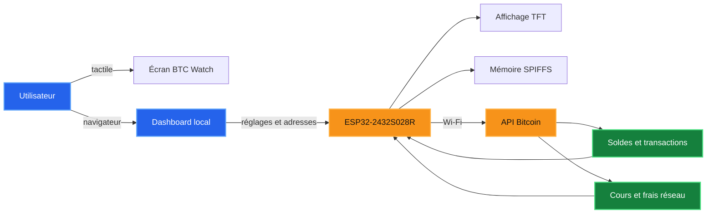
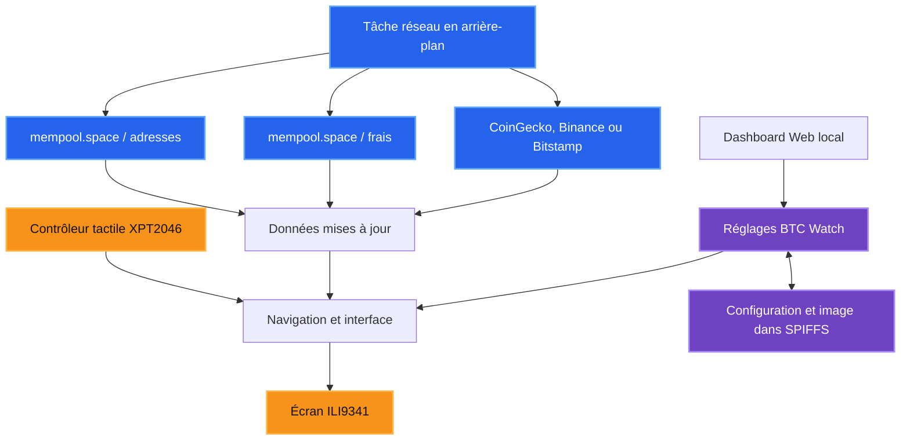
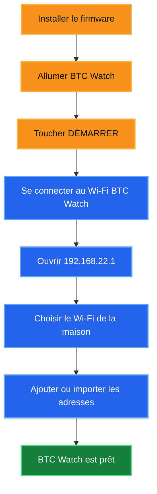
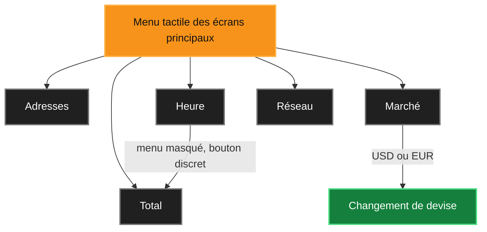
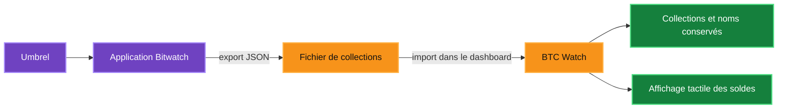

<p align="center">
  
</p>

<h1 align="center">BTC Watch</h1>

<p align="center">
  Tableau de bord Bitcoin tactile pour ESP32-2432S028R (Cheap Yellow Display).
</p>

<p align="center">
  
  
  
  
</p>

BTC Watch surveille jusqu'à 64 adresses Bitcoin publiques et affiche leur solde
total, leur contre-valeur en euros ou en dollars, le cours du Bitcoin, les frais
du réseau et une horloge entièrement personnalisable.

> Version actuelle : **0.8.9**

## 🧭 Vue d'ensemble

BTC Watch transforme le CYD en écran autonome de consultation. La configuration
se fait dans un navigateur, tandis que l'affichage quotidien et le changement
de mode se font directement avec l'écran tactile.



## ✨ Fonctionnalités

- suivi de 64 adresses Bitcoin publiques maximum ;
- solde confirmé, montant en attente et nombre de transactions ;
- valeur totale en EUR ou USD ;
- cours BTC fourni par CoinGecko, Binance ou Bitstamp ;
- frais du réseau Bitcoin fournis par mempool.space ;
- cinq écrans tactiles : Total, Adresses, Heure, Marché et Réseau ;
- horloge personnalisable : couleurs, textes, ligne et bouton ;
- image de fond envoyée directement depuis le navigateur ;
- recherche des réseaux Wi-Fi à proximité ;
- dashboard accessible depuis un téléphone ou un ordinateur ;
- import et export compatibles avec bitwatch-collections ;
- sauvegarde et restauration de la configuration complète ;
- remise à zéro d'usine avec le bouton BOOT ;
- installateur USB utilisable depuis un navigateur compatible.

## 🖥️ Matériel compatible

- **Carte :** ESP32-2432S028R / Cheap Yellow Display
- **Écran :** ILI9341, 2,8 pouces, 320 × 240 pixels
- **Tactile :** XPT2046 résistif
- **Mémoire flash :** 4 Mo
- **Orientation :** paysage

> [!WARNING]
> Le firmware précompilé est réservé au modèle **ESP32-2432S028R**. Vérifiez
> la référence de la carte avant l'installation.

## ⚙️ Comment BTC Watch fonctionne

Le programme sépare l'affichage, le tactile, la configuration et les appels
Internet afin que l'écran reste utilisable pendant les actualisations.



Le cycle normal est le suivant :

1. BTC Watch charge les réglages et les adresses depuis sa mémoire.
2. L'appareil maintient son réseau de secours **BTC Watch** actif.
3. Il se connecte en parallèle au réseau Wi-Fi choisi par l'utilisateur.
4. Les adresses sont interrogées auprès de mempool.space.
5. Le cours et les frais sont récupérés auprès des services configurés.
6. Les résultats sont additionnés puis présentés sur les différents écrans.
7. Les réglages modifiés dans le navigateur sont conservés après redémarrage.

## 🚀 Première utilisation



1. Installez le firmware sur le CYD.
2. Allumez l'appareil et touchez **DÉMARRER**.
3. Connectez votre téléphone ou ordinateur au réseau **BTC Watch**.
4. Utilisez le mot de passe initial **bitcoin21**.
5. Ouvrez [http://192.168.22.1](http://192.168.22.1).
6. Sélectionnez votre réseau Wi-Fi, saisissez son mot de passe et enregistrez.
7. Ajoutez ou importez vos adresses Bitcoin publiques.

Après la connexion au réseau local, le dashboard est également disponible à
l'adresse [http://btc-watch.local](http://btc-watch.local) lorsque mDNS est
pris en charge par l'appareil utilisé.

Le mot de passe du réseau de secours BTC Watch peut être remplacé depuis le
dashboard. Il doit contenir entre 8 et 63 caractères.

> [!TIP]
> Si l'adresse btc-watch.local ne répond pas pendant la première configuration,
> utilisez directement **192.168.22.1**.

## 🌐 Installation avec le webflasher

Le dossier [webflasher](webflasher) contient l'installateur destiné à Chrome
et Microsoft Edge sur ordinateur.

```mermaid
flowchart LR
    Browser["Chrome ou Edge en HTTPS"] --> Installer["Installateur BTC Watch"]
    Installer -->|Web Serial| USB["Câble USB de données"]
    USB --> ESP32["ESP32-2432S028R"]
    ESP32 --> Reboot["Redémarrage automatique"]
    Reboot --> AccessPoint["Réseau Wi-Fi BTC Watch"]
    classDef browser fill:#2563EB,color:#FFFFFF,stroke:#60A5FA,stroke-width:2px
    classDef device fill:#F7931A,color:#111111,stroke:#FFB347,stroke-width:2px
    classDef ready fill:#15803D,color:#FFFFFF,stroke:#4ADE80,stroke-width:2px
    class Browser,Installer browser
    class USB,ESP32 device
    class Reboot,AccessPoint ready
```



1. Publiez ce dossier sur un hébergement HTTPS, par exemple GitHub Pages.
2. Ouvrez la page de l'installateur dans un navigateur compatible.
3. Branchez le CYD avec un câble USB de données.
4. Cliquez sur **Installer BTC Watch**.
5. Sélectionnez le port série de l'ESP32.

Le manifeste utilise l'image factory :

    webflasher/firmware/btc-watch-0.8.9-esp32-2432s028r.factory.bin

Cette image contient le bootloader, la table des partitions, les données de
démarrage OTA et le programme principal.

> [!IMPORTANT]
> Utilisez un câble USB de données. Certains câbles prévus uniquement pour la
> recharge alimentent l'écran mais ne permettent pas l'installation.

## 🧰 Compilation avec PlatformIO

### 📋 Prérequis

- Visual Studio Code avec l'extension PlatformIO, ou PlatformIO Core ;
- un câble USB permettant le transfert de données ;
- les pilotes USB correspondant à la carte.

### 🔨 Compiler

    pio run -e cyd

### 📤 Compiler et téléverser

    pio run -e cyd -t upload

### 🖥️ Moniteur série

    pio device monitor -b 115200

Le point d'entrée PlatformIO est [src/main.cpp](src/main.cpp). Les dépendances
et les broches du matériel sont déclarées dans
[platformio.ini](platformio.ini) et [src/config.h](src/config.h).

## 👆 Interface tactile

| Écran | Fonction |
|---|---|
| **Total** | Affiche le solde cumulé, sa valeur, les transactions et le montant en attente. |
| **Adresses** | Affiche quatre adresses par page avec navigation précédente/suivante. |
| **Heure** | Affiche l'horloge plein écran et un bouton discret pour revenir à Total. |
| **Marché** | Affiche le cours BTC, la variation sur 24 h et les boutons USD/EUR. |
| **Réseau** | Affiche l'état du Wi-Fi et les frais Bitcoin recommandés. |

### 🔄 Parcours d'utilisation quotidien



## ₿ Gestion des adresses

Le dashboard permet :

- d'ajouter les adresses une par une ;
- d'importer un fichier bitwatch-collections.json ;
- de modifier le nom et la collection de chaque adresse ;
- d'ignorer les doublons ;
- d'exporter les adresses dans un fichier
  btc-watch-adresses-AAAA-MM-JJ.json.

Seules les adresses Bitcoin publiques doivent être utilisées.

## 🟣 Import depuis Bitwatch sur Umbrel

BTC Watch est compatible avec les fichiers de collections exportés par
[Bitwatch, disponible dans l'Umbrel App Store](https://apps.umbrel.com/app/bitwatch).
Bitwatch permet de regrouper plusieurs adresses dans des collections et
d'additionner leur solde. BTC Watch reprend cette organisation sur son écran.



### 📥 Procédure

1. Ouvrez Bitwatch dans Umbrel.
2. Exportez les collections d'adresses au format JSON.
3. Connectez-vous au dashboard BTC Watch.
4. Descendez jusqu'à la section **Adresses Bitcoin**.
5. Cliquez sur **Importer un fichier d'adresses**.
6. Sélectionnez le fichier exporté par Bitwatch.
7. Vérifiez le nombre d'adresses ajoutées, les doublons et les lignes invalides.
8. Cliquez sur **Enregistrer et actualiser**.

### 🧩 Structure reconnue

Le fichier doit contenir un objet <code>collections</code>. Chaque collection
possède un tableau <code>addresses</code>. BTC Watch utilise principalement les
champs <code>address</code> et <code>name</code>.

```json
{
  "collections": {
    "Épargne": {
      "addresses": [
        {
          "address": "adresse-bitcoin-publique",
          "name": "Portefeuille principal"
        }
      ],
      "extendedKeys": [],
      "descriptors": []
    }
  }
}
```

L'exemple utilise volontairement un texte de remplacement : renseignez une
véritable adresse Bitcoin publique dans un fichier réel.

BTC Watch :

- conserve le nom de la collection ;
- conserve le nom associé à l'adresse ;
- ignore les champs Bitwatch supplémentaires dont il n'a pas besoin ;
- ignore les doublons déjà présents ;
- refuse les lignes qui ne ressemblent pas à des adresses Bitcoin ;
- importe au maximum 64 adresses ;
- n'importe pas directement les clés étendues ou les descriptors : seules les
  adresses publiques présentes dans <code>addresses</code> sont utilisées.

L'export d'adresses de BTC Watch recrée la même organisation
<code>collections</code>, ce qui permet de réutiliser le fichier avec Bitwatch.

## 💾 Sauvegarde complète

Le bouton d'export crée un fichier :

    btc-watch-sauvegarde-AAAA-MM-JJ.json

Il contient notamment :

- les adresses et leurs catégories ;
- la configuration Wi-Fi ;
- le mot de passe du réseau BTC Watch ;
- le fuseau horaire et la luminosité ;
- la devise et la source du cours ;
- les textes et les couleurs de l'horloge ;
- les options d'affichage ;
- l'image de fond convertie en RGB565.

> [!CAUTION]
> Une sauvegarde complète contient les mots de passe en clair. Conservez-la
> dans un emplacement privé et ne la publiez jamais dans le dépôt GitHub.

## 🖼️ Image de fond de l'horloge

Le dashboard accepte une image PNG, JPEG, WebP ou GIF. Le navigateur :

1. recadre l'image au format 4:3 ;
2. la redimensionne en 320 × 240 pixels ;
3. la convertit en RGB565 ;
4. l'envoie dans la mémoire SPIFFS de l'ESP32.

L'heure, les textes, l'état Wi-Fi, la ligne décorative et le bouton de retour
restent affichés au-dessus de l'image. Le fond peut être remplacé ou supprimé.

## ♻️ Remise à zéro

Appareil allumé, maintenez le bouton arrière **BOOT** pendant cinq secondes.
Cette opération efface :

- la configuration Wi-Fi ;
- les adresses enregistrées ;
- les textes, couleurs et options d'affichage ;
- l'image de fond ;
- le mot de passe personnalisé du réseau BTC Watch.

Le bouton RST effectue uniquement un redémarrage.

## 📡 Sources de données

| Donnée | Source |
|---|---|
| Soldes et transactions | mempool.space |
| Frais recommandés | mempool.space |
| Cours BTC | CoinGecko, Binance ou Bitstamp |
| Heure | Serveurs NTP |

Les données dépendent de la disponibilité du Wi-Fi et des services externes.

## 🗂️ Organisation du dépôt

    BTC-Watch/
    ├── src/                 Code du firmware
    ├── assets/              Images sources du logo
    ├── tools/               Outil de génération des bitmaps
    ├── Firmware_CYD/        Binaires pour programmation manuelle
    ├── webflasher/          Installateur USB pour navigateur
    ├── platformio.ini       Configuration PlatformIO
    ├── README.md            Documentation du projet
    └── LICENSE              Licence MIT

Les dossiers .pio et les fichiers locaux générés par VS Code ne doivent pas
être ajoutés au dépôt.

## 🔐 Sécurité

> [!IMPORTANT]
> BTC Watch est un outil de consultation. Il ne demande et ne doit recevoir
> aucune clé privée.

**Ne saisissez et n'importez jamais :**

- une clé privée ;
- une phrase de récupération ;
- un fichier wallet contenant des secrets ;
- une seed Bitcoin.

Le projet doit uniquement recevoir des adresses publiques.

## 📄 Licence

Ce projet est distribué sous licence MIT. Consultez le fichier
[LICENSE](LICENSE).
